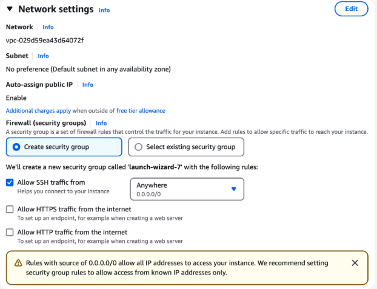
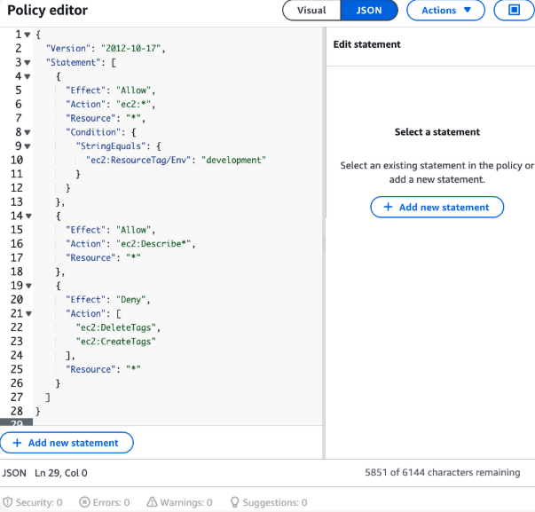
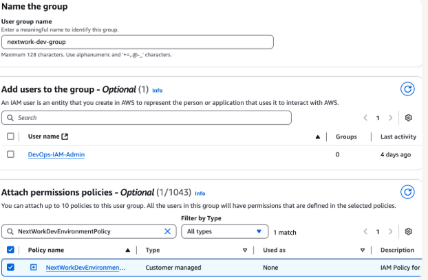
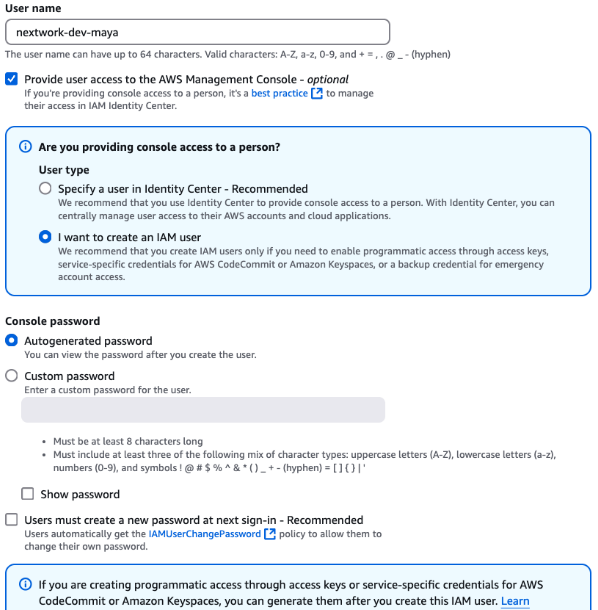
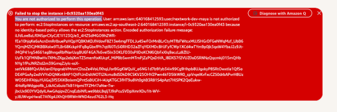

# IAM
1. we know identity and access management service is for who is authenticated and authorized to use resources in aws acc.
2. we first create an EC2 or 'elastic cloud compute instance.
3. chosen new tags with key=env, value=production.
4. we got through this without key pair or secure shell.
5. 
6. then created an IAM, then to policies. Chose create policy, switched to JSON.
7. 
8. create alias for the user to unboard.
9. creating a group: helps in simplifying and attaching policies to everyone at once.
10. 
11. we then add users to that group so that we dont have to do that for everyone. 
12. 
13. 
tried to access restricted stuff and failed since we're not allowed.
