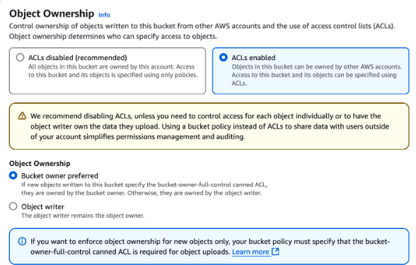
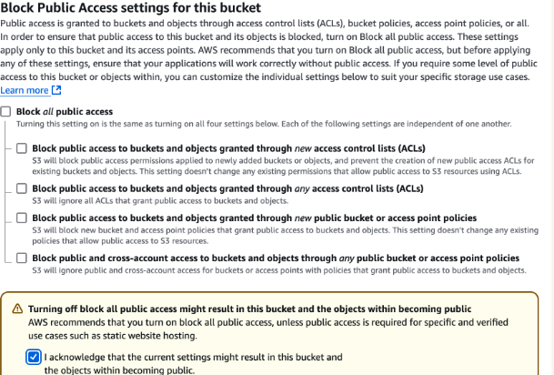
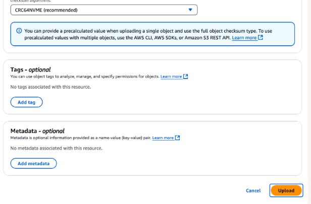
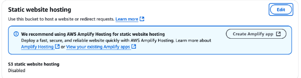
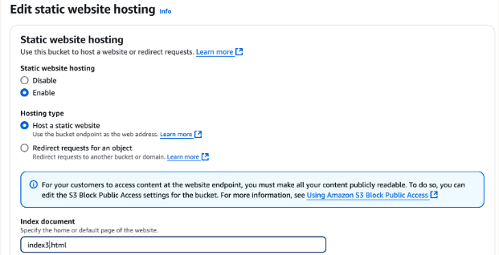
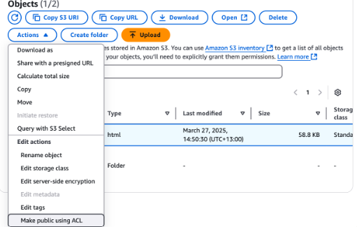
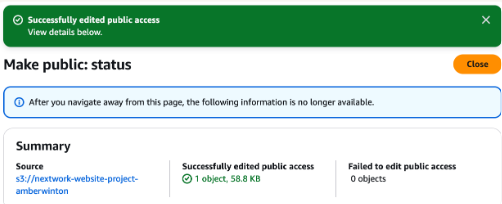

# S3 website hosting

1. created a s3 bucket and named it after my name. 
( buckets names are specific and can't be relicated anywhere, for eg unless i delete my bucket another bucket of same name can't be created.)
2. Used ACL(access control list) instead of bucket policies for Object Owndership,

acl allow us to set rules for every single object on our device and who all can use it.
3. clear block all public access box since its been helps to be discovered in public traffic.

4. 
5. 
6. index document is chosen to any index.html file or  any main file to be displayed.

7. get URL under bucket website endpoint
that end poin url shows the url to the website.
8. 
html is by default private we need to change it to public by changing permissions.
9. 
when changed status this should look like this.
